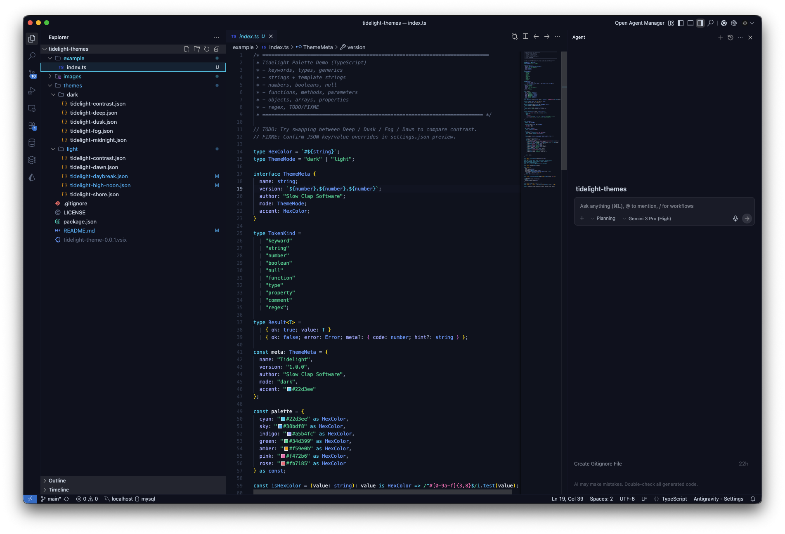
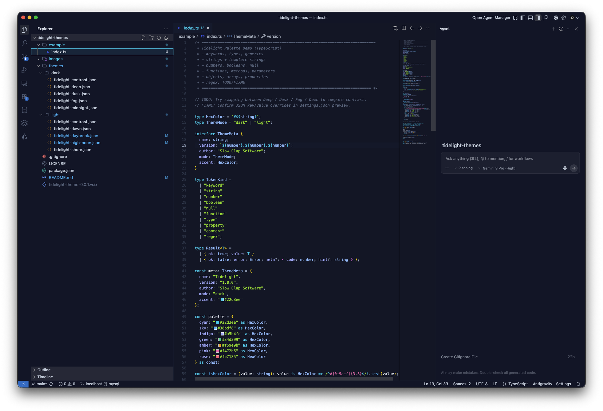
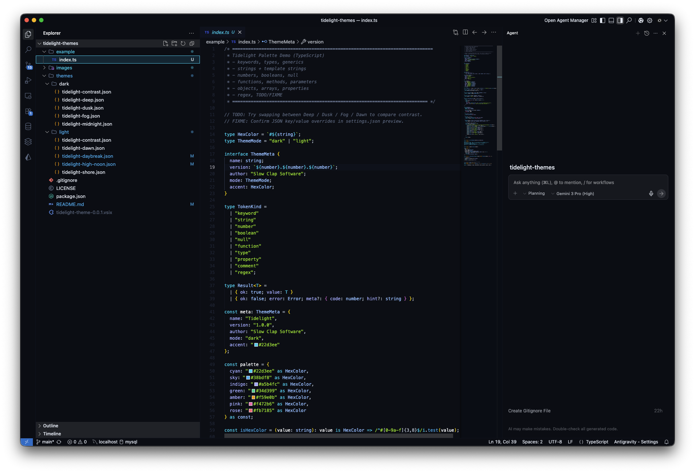
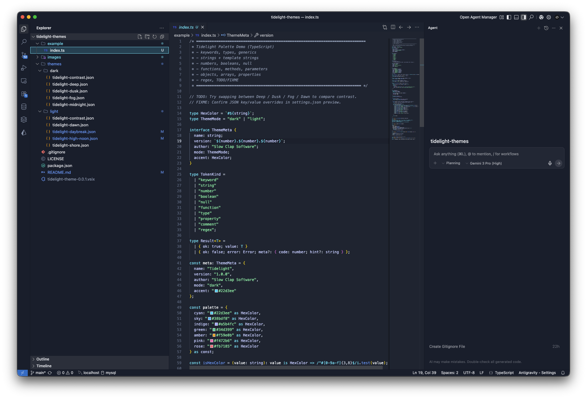
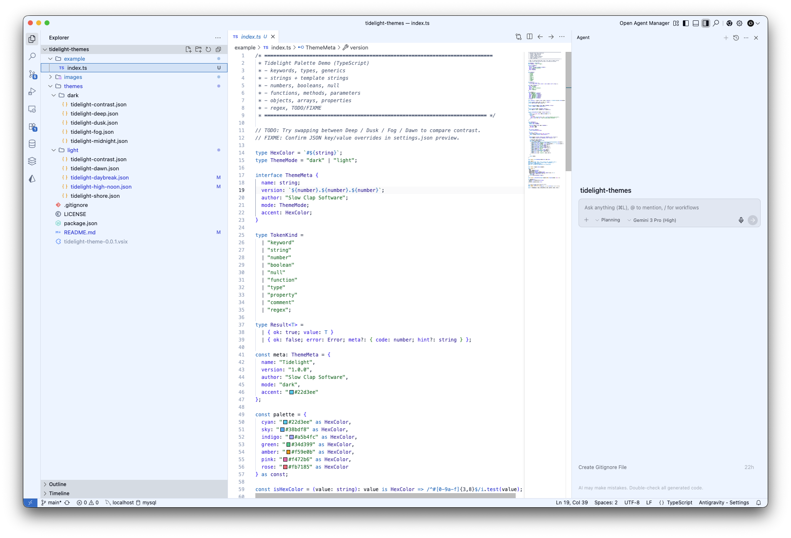
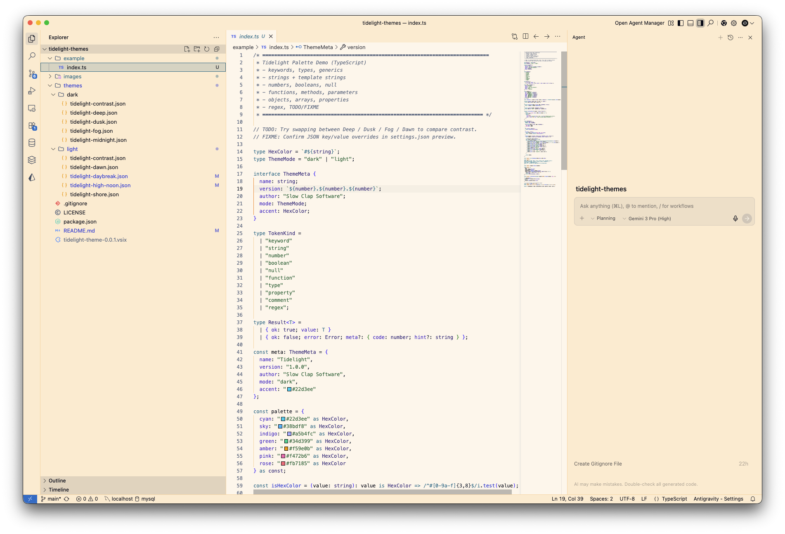
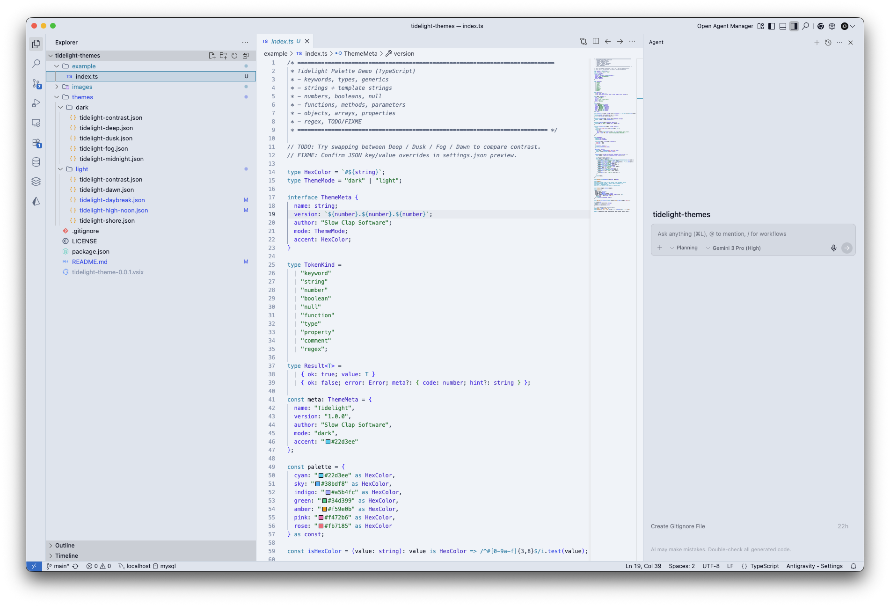

# Tidelight Theme Pack

A cyan-led VS Code theme family built for clean contrast, comfortable readability, and modern UI polish — with thoughtful syntax highlighting for TypeScript/JavaScript and beyond.

**Included themes:**
- **Tidelight Deep** (dark, balanced)
- **Tidelight Dusk** (dark, softer background + warmer strings)
- **Tidelight Midnight** (dark, deeper contrast)
- **Tidelight Fog** (dark, smokey + lifted)
- **Tidelight Contrast** (high-contrast dark)
- **Tidelight Dawn** (light, clean + calm)
- **Tidelight Daybreak** (light, brighter + higher contrast)
- **Tidelight High Noon** (light, warm + bright)
- **Tidelight Shore** (light, neutral “paper”)
- **Tidelight Contrast** (high-contrast light)

> Published by **Slow Clap Software**

---

## Screenshots





.png)




.png)

---

## Installation

### From the VS Code Marketplace
1. Open **Extensions** in VS Code (`Ctrl/Cmd+Shift+X`)
2. Search for **Tidelight**
3. Click **Install**

### From a VSIX (manual install)
1. Download the `.vsix`
2. Open VS Code → **Extensions**
3. Click the `...` menu → **Install from VSIX...**

---

## Activating the theme

1. Open the Command Palette:
   - **Windows/Linux:** `Ctrl+Shift+P`
   - **macOS:** `Cmd+Shift+P`
2. Search for: **Preferences: Color Theme**
3. Choose a theme from the **Tidelight** collection

---

## Theme philosophy

Tidelight is designed around:
- **Cyan-led accents** inspired by Tailwind’s cyan palette
- **Comfortable contrast** (including dedicated high-contrast variants)
- **Clean UI separation** (tabs / panels / sidebar)
- **Syntax clarity** for modern codebases

While tuned for TS/JS workflows, Tidelight aims to look great across most languages.

---

## Included highlighting improvements

Tidelight includes extra rules for common “high ROI” file types:

### JSON readability
Distinct coloring for:
- **keys**
- **string values**
- **numbers**
- **booleans / null**
- **punctuation**

### Markdown polish
Improved styling for:
- headings
- bold / italic
- inline code
- links

### Diff + Git
Readable inserted / deleted / changed blocks for diffs.

### TODO / FIXME / NOTE
These stand out clearly without being distracting.

### Regex
Regex patterns are easier to scan in code.

---

## Recommended settings

These are optional, but pair nicely with Tidelight:

```json
{
  "editor.fontLigatures": true,
  "editor.renderWhitespace": "selection",
  "editor.guides.bracketPairs": true,
  "editor.bracketPairColorization.enabled": true,
  "workbench.colorTheme": "Tidelight Deep"
}